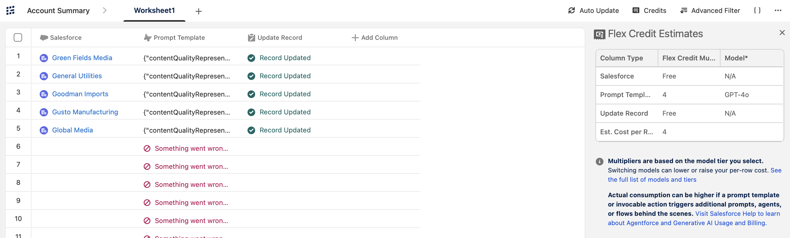
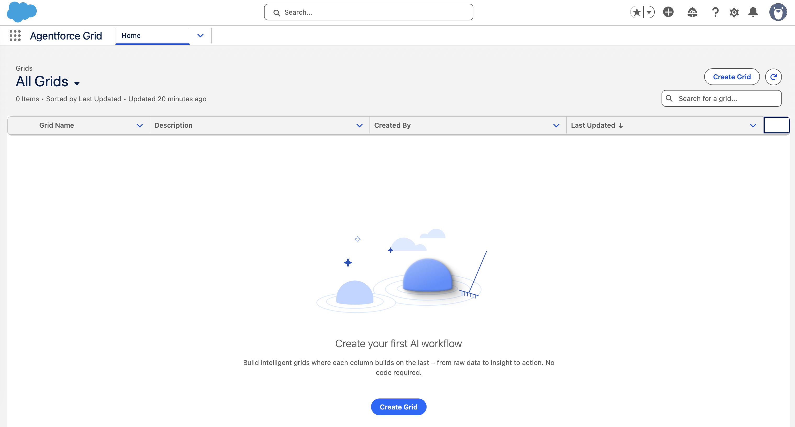
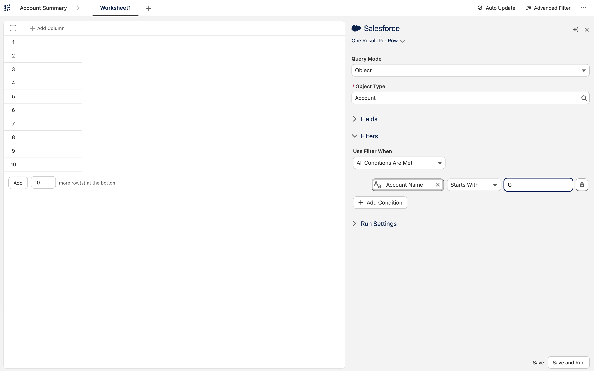
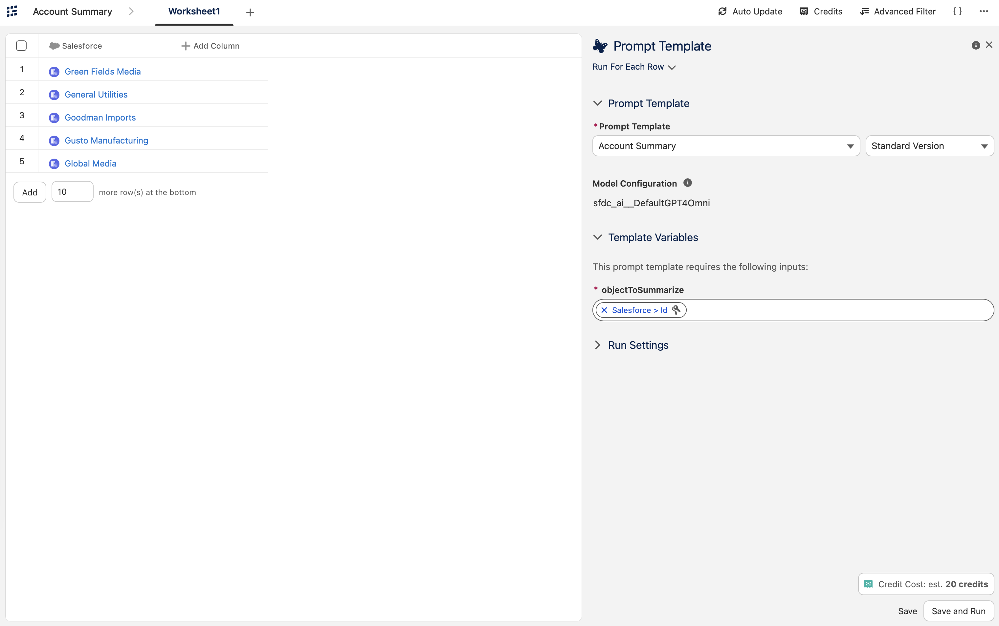
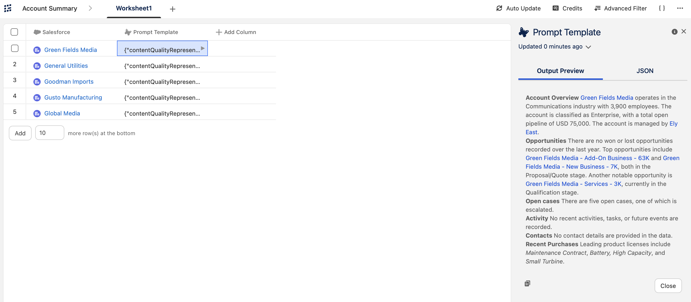
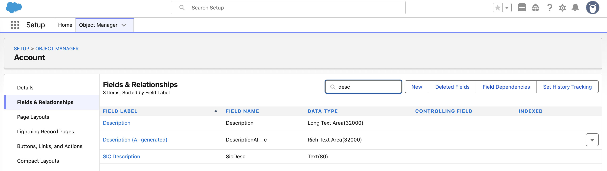
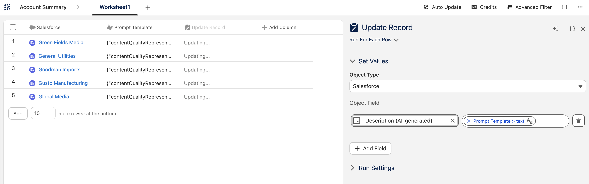
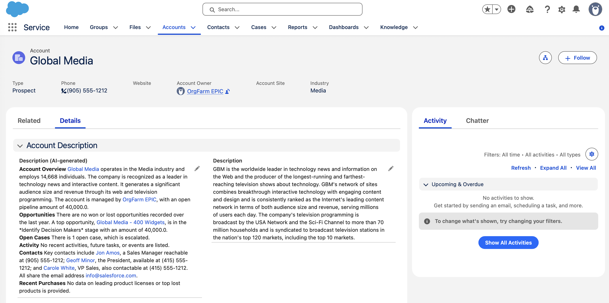

# Agentforce Grid AI Account Summary

## Overview

This project demonstrates how Salesforce Agentforce Grid and Prompt Builder can be combined to automate account intelligence generation directly inside Salesforce CRM.  

Using a no-code workflow, I created an AI-powered process that retrieves account records, generates contextual business summaries using generative AI, and writes the generated insights back into Salesforce records as formatted rich text.

The project showcases how AI can transform raw CRM data into actionable business intelligence directly within the user workflow.



## Project Objectives

The objectives of this project were:

- Build an AI-powered workflow using Agentforce Grid
- Retrieve targeted Salesforce account records dynamically
- Generate AI-based account summaries using Prompt Builder
- Use GPT-4o to enrich CRM data with contextual intelligence
- Automatically write generated summaries back into Salesforce
- Demonstrate practical enterprise AI automation inside Salesforce CRM

## Architecture

```text
[ Salesforce Accounts ]
            ↓
[ Agentforce Grid ]
            ↓
[ Prompt Builder Template ]
            ↓
[ GPT-4o AI Model ]
            ↓
[ AI Generated Account Summary ]
            ↓
[ Update Record Action ]
            ↓
[ Salesforce Rich Text Field ]
````

## Salesforce Technologies Used

* Salesforce Agentforce Grid
* Salesforce Prompt Builder
* GPT-4o Model
* Salesforce CRM
* Salesforce Object Manager
* Custom Rich Text Fields
* AI Prompt Templates
* Record Update Actions
* Account Object Automation

## Task 1 — Create the Agentforce Grid

I started by creating a new Agentforce Grid workflow named **Account Summary**.

The goal of the grid was to automatically generate AI-powered summaries for Salesforce Account records.



## Task 2 — Retrieve Salesforce Account Records

I configured the grid to retrieve records directly from Salesforce.

The workflow queried the Account object and filtered records where the Account Name started with the letter **G**.

This allowed the grid to dynamically populate records such as:

* Green Fields Media
* General Utilities
* Global Media



## Task 3 — Configure Prompt Builder

I added a Prompt Template column to the grid and configured it to use:

* Prompt Template: **Account Summary**
* AI Model: **GPT-4o**
* Input Variable: `objectToSummarize`

The workflow passed the Salesforce Account ID into the prompt template for each record.



## Task 4 — Generate AI Account Summaries

Once the workflow executed, the AI generated contextual account overviews automatically.

The generated summaries included:

* Industry information
* Employee count
* Open opportunities
* Pipeline values
* Open support cases
* Recent purchases
* Key account insights

This transformed raw CRM data into business-ready summaries.



## Task 5 — Create a Custom Rich Text Field

To store the AI-generated content, I created a custom Salesforce field named:

**Description (AI-generated)**

The field type used was:

* Rich Text Area

Using Rich Text preserved formatting and improved readability directly inside Salesforce record pages.



## Task 6 — Update Salesforce Records Automatically

I then added an Update Record action inside Agentforce Grid.

The generated AI summary output was mapped directly into the custom rich text field on the Account object.

This created a fully automated AI enrichment workflow.



## Task 7 — Validate the AI-Powered CRM Experience

Finally, I validated the completed workflow directly on Salesforce Account records.

When users opened records such as **Global Media**, they could immediately view:

* AI-generated account summaries
* Opportunity insights
* Open case information
* Customer context
* Key account activity

All information was displayed directly in the Salesforce Details page without requiring users to leave the CRM interface.



## Key Features Implemented

* AI-powered account summarization
* Prompt Builder integration
* GPT-4o generative AI configuration
* Automated CRM enrichment
* Dynamic Salesforce data retrieval
* Rich text formatting for AI outputs
* Automated record updates
* No-code AI workflow orchestration

## Key Skills Demonstrated

* Salesforce Agentforce Grid
* Salesforce Prompt Builder
* AI workflow automation
* CRM data enrichment
* Prompt engineering
* Salesforce data modeling
* Generative AI integration
* No-code automation design
* Enterprise AI implementation

## Conclusion

This project demonstrated how Salesforce Agentforce Grid and Prompt Builder can automate the generation of contextual business intelligence directly inside Salesforce CRM.

By combining Salesforce records, GPT-4o AI generation, and automated record updates, I created a workflow that enriches customer records with meaningful insights while improving user productivity and decision-making.

The experience strengthened my understanding of enterprise AI workflows, prompt-driven automation, and scalable CRM intelligence solutions built entirely within the Salesforce ecosystem.

## References
- [Agentic Workflow Automation Quest](https://trailhead.salesforce.com/users/teamtrailhead/trailmixes/quest-agentic-workflow-automation)
- [Salesforce Docs: Agentforce Grid](https://help.salesforce.com/s/articleView?id=ai.agentforce_grid.htm&type=5)
