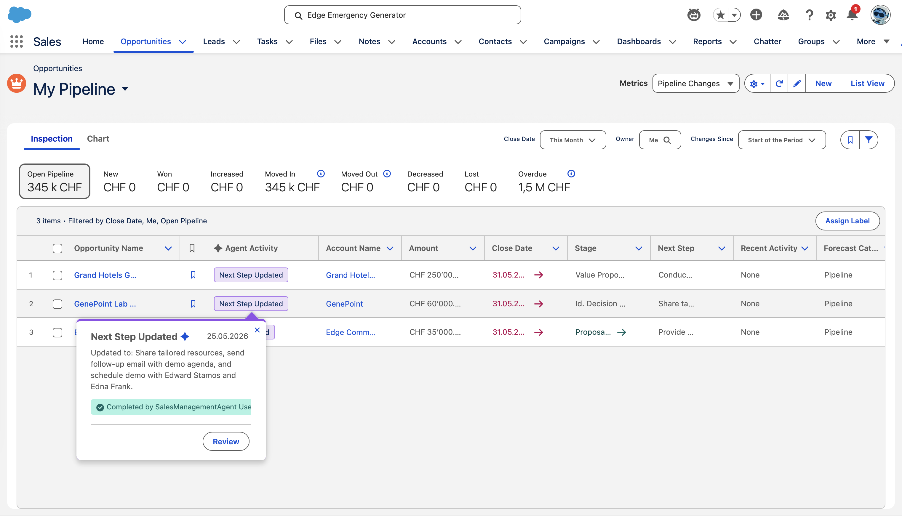
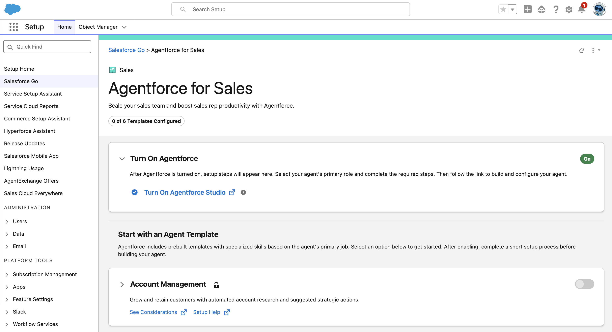
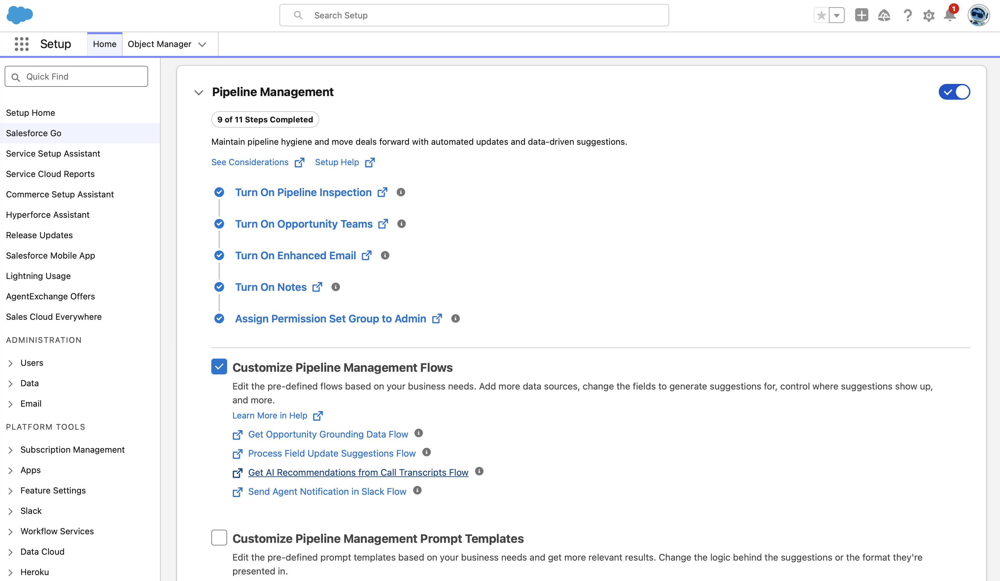
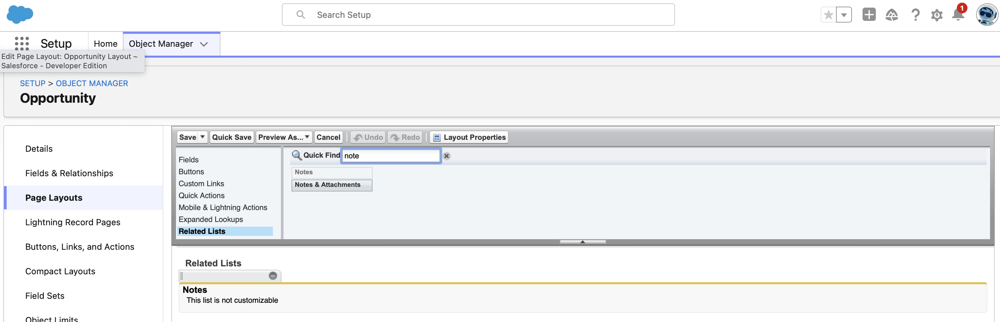
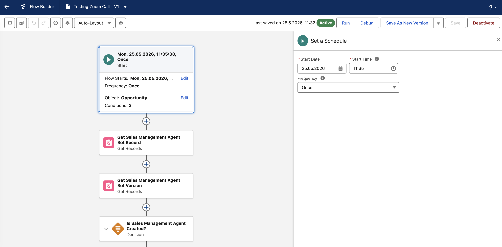
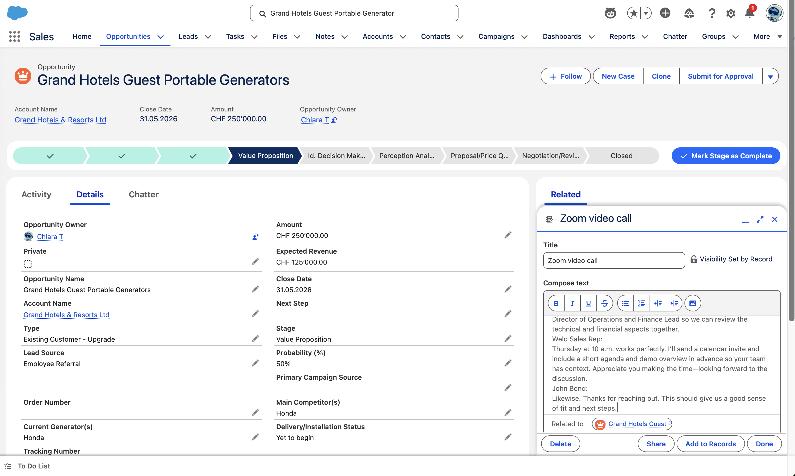
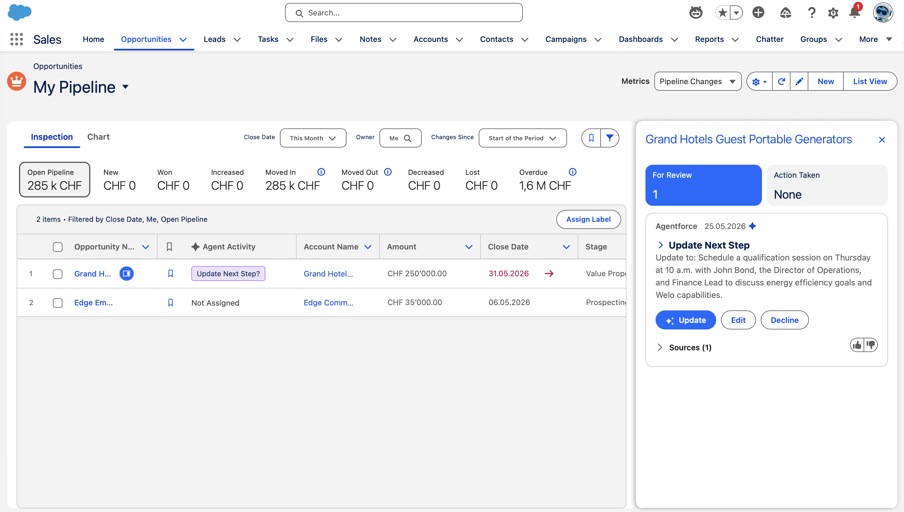
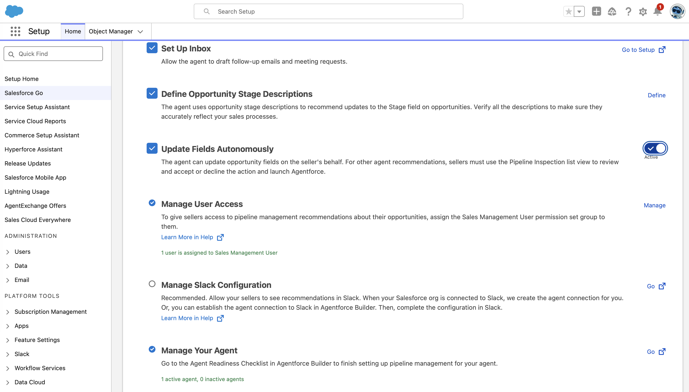
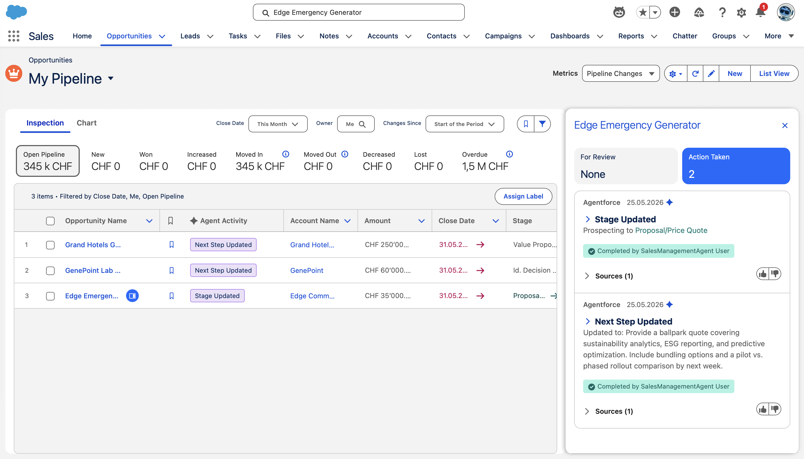

# Agentforce Pipeline Management

## Overview

This project focused on enabling, configuring, and testing Salesforce Agentforce Pipeline Management capabilities within a sales environment. The objective was to explore how Salesforce AI-powered agents can improve opportunity management, automate repetitive sales tasks, and help sales teams act on customer interactions more efficiently.

The project combined Agentforce for Sales, Salesforce Flow automation, Einstein features, and AI-driven recommendations to demonstrate how intelligent pipeline management can support revenue operations and seller productivity.



---

## Project Objectives

The project was designed to demonstrate how AI can:
- Recommend opportunity field updates
- Surface important customer interactions
- Suggest follow-up actions
- Improve sales pipeline visibility
- Automate repetitive sales management tasks
- Help sales representatives prioritize high-impact work

---

## Architecture

```AI-Sales-Pipeline-Management-Architecture
[ Sales Representative ]
          ↓
[ Opportunity Record ]
          ↓
[ Notes / Emails / Meetings ]
          ↓
[ Salesforce Flow Automation ]
          ↓
[ Agentforce Pipeline Management ]
          ↓
[ Einstein Activity Capture ]
          ↓
[ AI Analysis & Recommendations ]
          ↓
[ Opportunity Inspection Workspace ]
          ↓
[ Suggested Next Steps & Field Updates ]
          ↓
[ Salesforce CRM Data ]
```

The architecture demonstrated how Salesforce AI services process sales activities and opportunity interactions to generate intelligent recommendations and automate pipeline management tasks directly inside the CRM workflow.

---

## Salesforce Technologies Used

- Salesforce Go
- Agentforce Studio
- Agentforce for Sales
- Pipeline Management
- Einstein Conversation Insights
- Einstein Activity Capture
- Salesforce Flow Automation
- Opportunity Management
- Inbox Integration

---

## Task 1 — Enable Agentforce Pipeline Management

I started by enabling Agentforce Studio and Agentforce for Sales through Salesforce Go. This configuration activated the core AI-powered sales management features required for Pipeline Management.

I enabled the following supporting capabilities:

- Pipeline Management
- Conversation Intelligence
- Einstein Activity Capture
- Inbox Integration
- Opportunity Stage Descriptions
- Autonomous Field Updates

This setup allowed the AI agent to analyze seller interactions and generate intelligent recommendations based on notes, emails, and customer conversations.




## Task 2 — Configure Opportunity Management Features

Next, I configured the Opportunity object and supporting layouts to prepare the CRM environment for AI-driven pipeline analysis.

I updated the Opportunity page layout by adding the Notes related list so that the agent could process meeting notes and conversation summaries associated with sales opportunities.

I also updated organization and user timezone settings to ensure that automation flows triggered correctly according to local scheduling configurations.



## Task 3 — Configure Pipeline Management Flows

I configured and activated the Process Field Update Suggestion Flow used by the Pipeline Management agent.

To support testing scenarios, I adjusted the flow start conditions and scheduling logic so that the AI agent could process newly created opportunity notes in near real time.

This flow enabled the system to:
- Analyze opportunity activity
- Generate recommended next steps
- Suggest field updates
- Surface important sales insights automatically



## Task 4 — Create and Analyze Opportunity Notes

I tested the agent by creating detailed sales meeting notes and customer interaction summaries directly within Opportunity records.

The notes included:
- Customer business goals
- Sustainability and operational efficiency discussions
- Procurement requirements
- Stakeholder information
- Sales qualification details
- Proposed next steps

The AI agent analyzed the notes and generated recommendations directly within the Opportunity Inspection panel.



## Task 5 — Test AI-Generated Recommendations

After the automation flow executed, the agent surfaced actionable recommendations inside Salesforce.

The AI-generated recommendations included:
- Suggested next steps
- Opportunity stage updates
- Follow-up reminders
- Sales progression insights


I reviewed the recommendations directly from the Agent Activity section within the Opportunity workspace.

This demonstrated how Salesforce AI can reduce manual CRM maintenance while helping sellers focus on customer engagement and deal progression.



## Task 6 — Enable Autonomous Updates

I enabled the autonomous update capability within Pipeline Management so the AI agent could automatically suggest and apply updates to opportunity records.

I created additional opportunity notes to simulate:
- Onsite customer meetings
- Product qualification discussions
- Proposal and pricing requests
- Urgent procurement timelines

The AI agent processed these interactions and autonomously updated opportunity-related information based on the conversation context.



## Task 7 — Validate AI Opportunity Updates

Finally, I reviewed the updated opportunity records and verified the AI-generated field changes and recommendations.

The agent successfully:
- Interpreted unstructured sales notes
- Identified opportunity progression indicators
- Recommended stage updates
- Suggested actionable next steps
- Assisted with pipeline prioritization

This demonstrated how AI-powered sales automation can improve CRM accuracy and accelerate sales workflows.



---

## Key Features Implemented

- Enabled Agentforce for Sales using Salesforce Go
- Configured Pipeline Management features and supporting flows
- Enabled AI-driven opportunity management recommendations
- Configured Conversation Intelligence and Einstein Activity Capture
- Enabled Inbox integration for sales productivity
- Customized Pipeline Management flows and opportunity updates
- Updated Opportunity page layouts with Notes related lists
- Configured organization and user timezone settings for accurate automation timing

## Key Skills Demonstrated

- Salesforce AI configuration
- Agentforce for Sales setup
- Pipeline Management implementation
- Opportunity workflow automation
- Einstein Activity Capture configuration
- Flow automation management
- CRM optimization
- AI-assisted sales operations
- Sales process analysis
- Enterprise workflow testing

---

## Conclusions

This project demonstrated how Salesforce Agentforce Pipeline Management can enhance seller productivity by combining AI recommendations, workflow automation, and CRM intelligence into a unified sales experience.

Through this implementation, I gained hands-on experience configuring Salesforce AI tools, enabling automation features, testing intelligent workflows, and validating AI-generated opportunity updates.

The project also reinforced how enterprise AI systems can reduce administrative workload, improve opportunity visibility, and help sales teams focus on higher-value customer interactions and revenue generation.


## Resources
- [Trailhead: Sales Pipeline Management with Agents](https://trailhead.salesforce.com/content/learn/modules/build-an-agent-to-manage-your-pipeline?trailmix_creator_id=teamtrailhead&trailmix_slug=quest-tdx-2026)
- [Salesforce Help: Agentforce Pipeline Management](https://help.salesforce.com/s/articleView?id=sales.pipeline_mgmt_parent.htm&type=5)
- [Salesforce Help: Considerations for Agentforce Pipeline Management](https://help.salesforce.com/s/articleView?id=sales.pipeline_mgmt_considerations.htm&type=5)
- [Salesforce Help: Agentforce Pipeline Management Overview](https://help.salesforce.com/s/articleView?id=sales.pipeline_mgmt_overview.htm&type=5)
- [Salesforce Help: Agentforce Pipeline Management Permissions](https://help.salesforce.com/s/articleView?id=sales.pipeline_mgmt_perms.htm&type=5)
