# Create a Reactive Screen

## Introduction

This module introduced reactive functionality in Salesforce Screen Flows using Flow Builder. The objective was to understand how screen 
components can respond dynamically to user input without requiring navigation between screens. The exercises demonstrated how reactivity 
improves usability, reduces unnecessary clicks, and creates a more intuitive experience for end users.

During the project, I created a reactive screen flow for a support team case creation process. The flow included dynamic field behavior, 
reactive formulas, calculated dates, and conditional visibility messages based on user interaction.

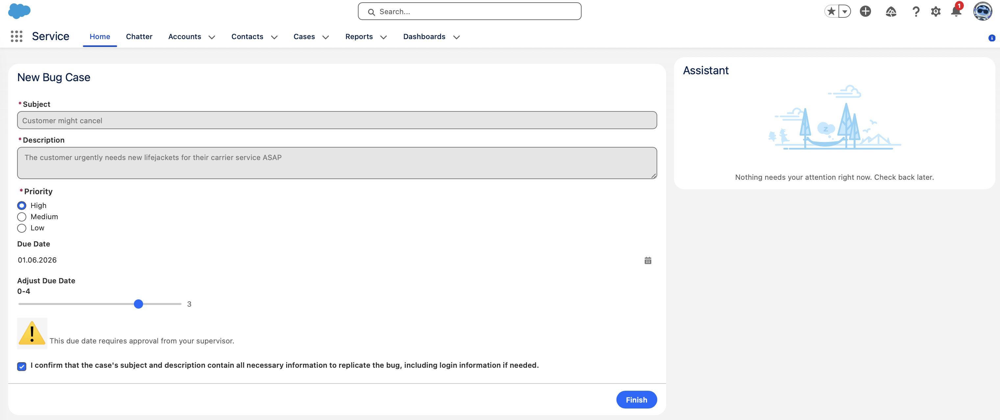

---

## Task 1 — Create the Reactive Flow

I started by creating a new Screen Flow in Flow Builder. I added a screen named **Get Case Details** and configured the required components:

* Subject (Text)
* Description (Long Text Area)
* Priority (Radio Buttons)
* Due Date (Date)
* Confirmation Checkbox

The Priority field used a Picklist Choice Set connected to the `Case.Priority` field.

After creating the components, I saved the flow as **New Bug Case**.

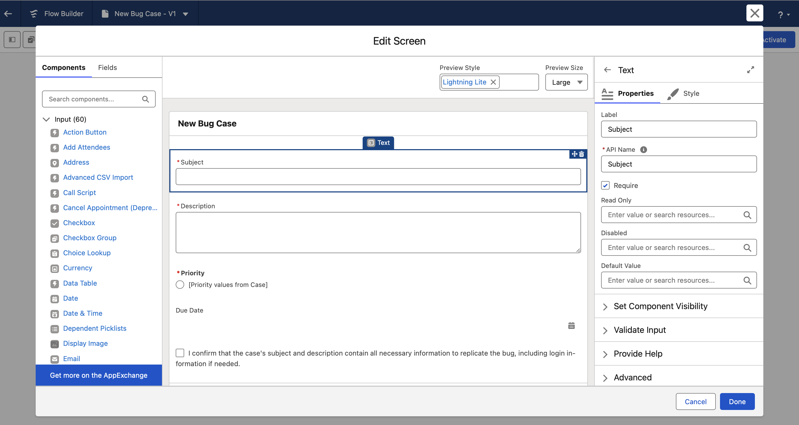

---

## Task 2 — Disable Fields Reactively

Next, I configured the flow so that the Subject field became disabled when the confirmation checkbox was selected.

I updated the **Disabled** property of the component to reference the Confirmation checkbox value. This allowed the fields to 
react instantly whenever the checkbox state changed.

This implementation demonstrated how reactive components can dynamically control other components on the same screen.

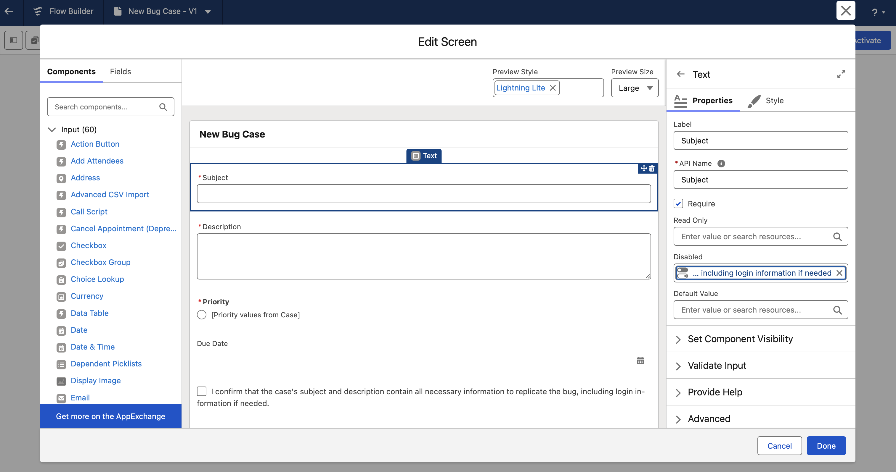

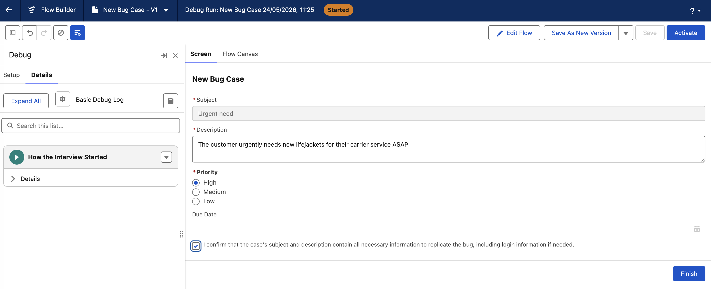

---

## Task 3 — Pre-Select a Picklist Value Reactively

I created a reactive formula resource named `DefaultPriority` to automatically assign a priority value based on keywords entered 
in the Subject field.

The formula checked whether the subject contained the words “urgent” or “cancel” and returned `"High"` when detected; otherwise 
it returned `"Medium"`.

```text
IF(
   OR(
      CONTAINS(LOWER({!Subject}),"urgent"),
      CONTAINS(LOWER({!Subject}),"cancel")
   ),
   "High",
   "Medium"
)
```

I then assigned this formula to the Default Value property of the Priority component.

This allowed the Priority field to update automatically while typing in the Subject field.

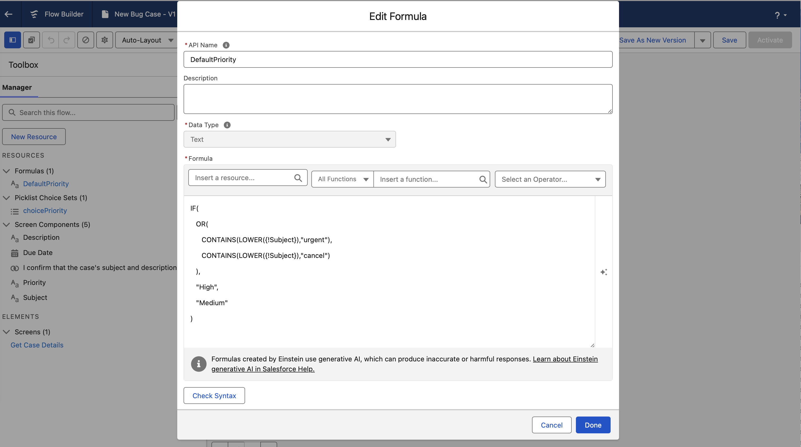

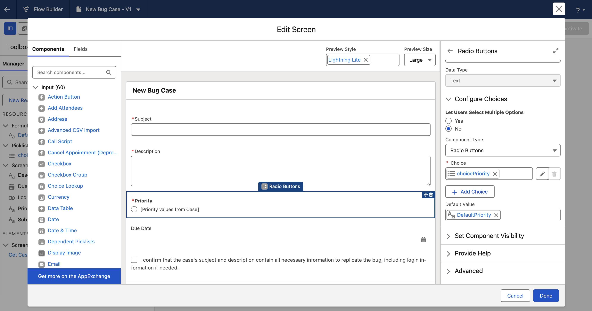

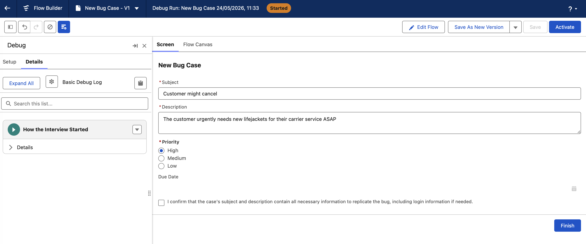

---

## Task 4 — Calculate a Date Reactively

To calculate the Due Date dynamically, I added a Slider component called `AdjustDueDate`. The slider allowed users to 
extend the calculated due date by up to four additional days.

I then created a formula resource named `DefaultDueDate`.

```text
TODAY()
+CASE({!Priority},"High",3,"Medium",10,"Low",18,10)
+IF(
   ISNULL({!AdjustDueDate.value}),
   0,
   {!AdjustDueDate.value}
)
```

This formula calculated the due date according to the selected priority level and included the slider adjustment value.

I assigned this formula to the Due Date component’s Default Value property.

The Due Date updated reactively whenever the user changed the priority or moved the slider.

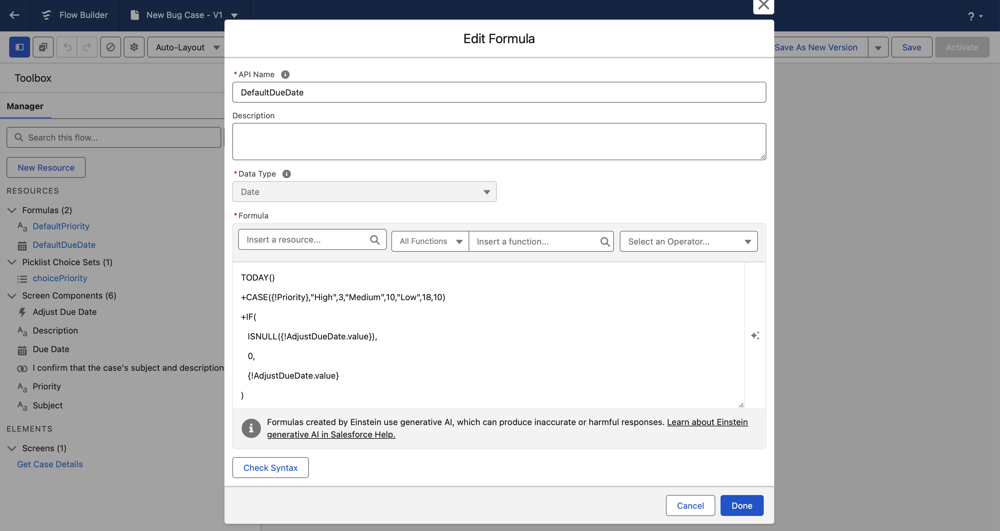

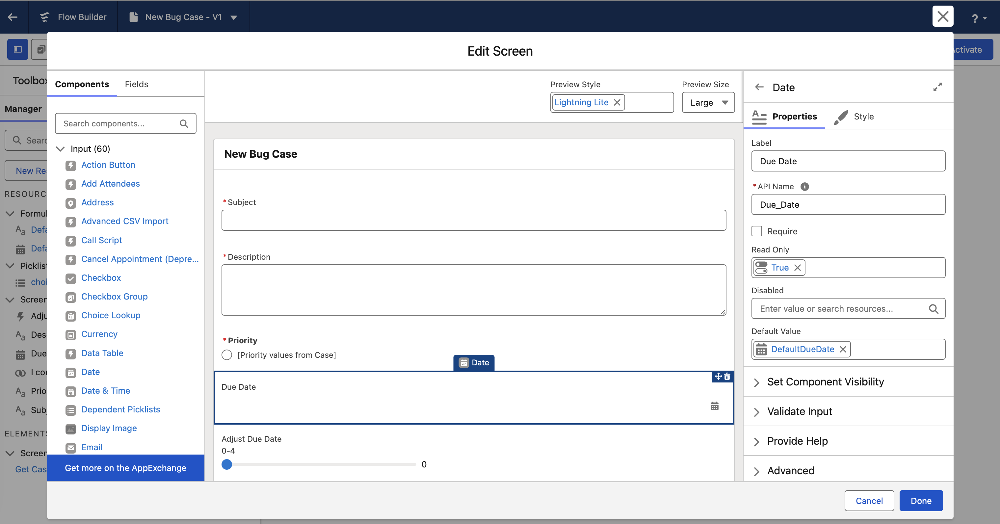


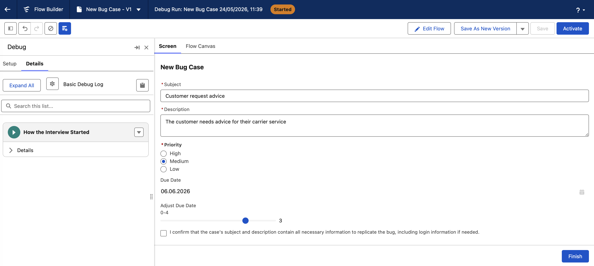

---

## Task 5 — Configure Conditional Visibility

Finally, I added two Display Text components to provide approval guidance based on the slider value.

The first message displayed a warning when the due date adjustment was greater than or equal to three days.

The second message displayed a positive confirmation when the adjustment remained below three days or when the slider value was null.

I configured conditional visibility rules for both components using reactive conditions.

This implementation showed how screen flows can provide immediate feedback to users without validation errors or additional screens.


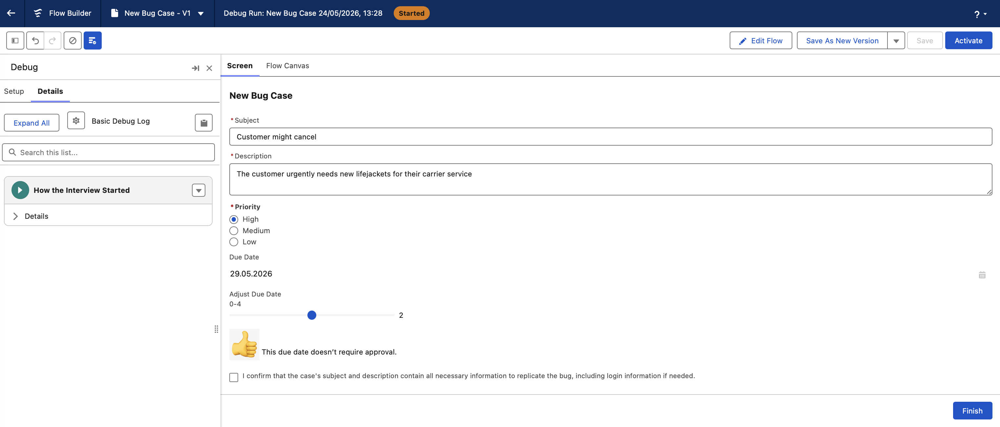

---

## Conclusion

In this module, I learned how Salesforce Screen Flow reactivity improves the user experience by allowing components to respond 
instantly to user actions. I implemented reactive field disabling, reactive formulas, calculated dates, and conditional visibility 
within a single screen.

The project demonstrated how reactivity reduces unnecessary navigation and provides users with immediate feedback while entering 
information. I also learned how formulas and component visibility rules can work together to create dynamic and intuitive flows 
in Salesforce Flow Builder.

Overall, this module provided practical experience in building more interactive and user-friendly Salesforce screen flows.

## References

1. [Trailhead: Create a Reactive Screen](https://trailhead.salesforce.com/content/learn/projects/quick-start-build-reactive-screen-flows/create-a-reactive-screen?trailmix_creator_id=teamtrailhead&trailmix_slug=quest-tdx-2026)
2. [Salesforce documentation: Make Your Screen Flows Reactive](https://help.salesforce.com/s/articleView?id=platform.flow_build_make_reactive.htm&language=en_US&type=5)
