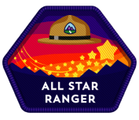
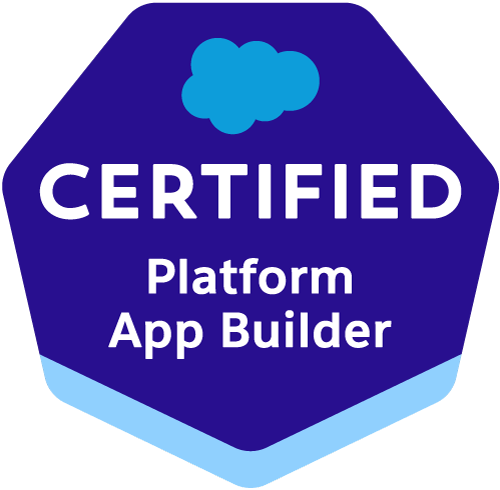
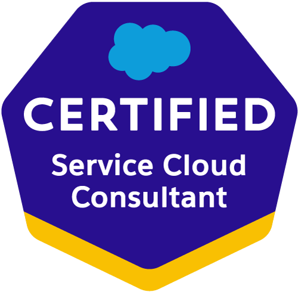
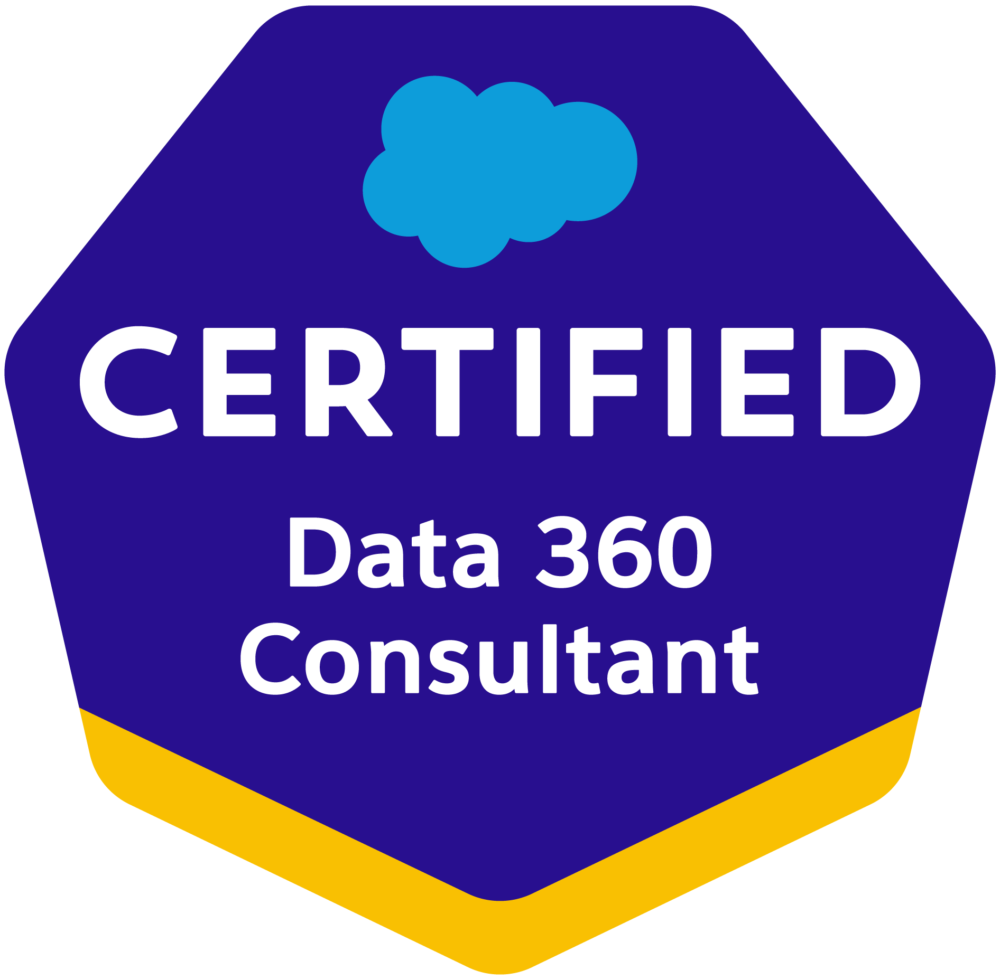
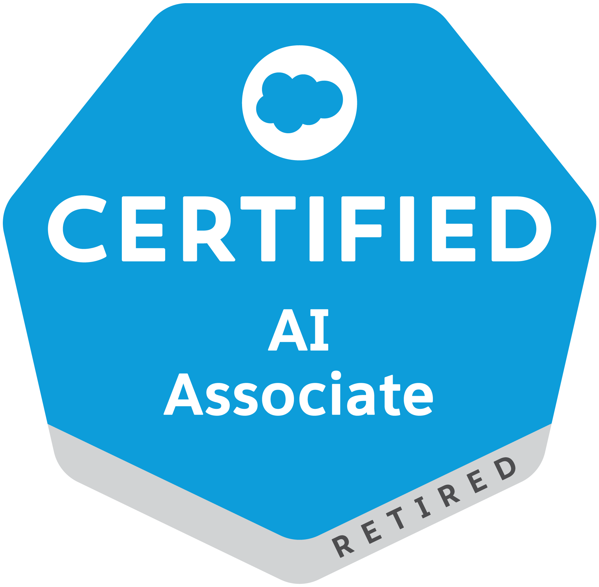

# My Salesforce Journey

Hi, I'm Chiara, and I started my Salesforce journey in 2022 when I enrolled in the **Bring Women Back to Work Program**.  
What began as a new learning opportunity quickly became a passion for CRM, automation, AI, and cloud technologies within the Salesforce ecosystem.

Since then, I have earned:

- **6 Salesforce Certifications**
- **600+ Trailhead Badges**
- The **Trailhead All Star Ranger** rank

This repository collects my Salesforce learning journey, practical exercises, AI projects, Flow automations, Agentforce implementations, and integrations across the Salesforce ecosystem.

  <a href="https://www.salesforce.com/trailblazer/profile">
    
    Click here to view my Trahilhead profile
  </a>

## Core Certifications

 
 
 
 

## AI Certifications & Badges

 
 

         
## AI-Powered Salesforce Agents

These projects focus on Agentforce AI agents, conversational automation, and intelligent CRM workflows.

  <a href="./AI%20Service%20Agent/readme.md">
    
    AI Agent for Service
  </a>

  <a href="./AI%20Sales%20Agent/readme.md">
    
    AI Agent for Sales
  </a>

  <a href="./AI%20Slack%20Agent/readme.md">
    
    AI Agent for Slack
  </a>

## Machine Learning Tools in Salesforce

This section contains projects focused on AI-powered CRM enrichment and generative AI workflows.

  <a href="./AI%20Agentforce%20Grid/readme.md">
    
    Agentforce Grid
  </a>

## Salesforce Flows

Projects related to Salesforce Flow Builder, reactive screens, and user experience automation.

  <a href="./Flows/01-ReactiveScreen.md">
    
    Reactive Screens for Flows
  </a>

## Areas of Interest

- Salesforce Administration
- Agentforce AI
- Flow Automation
- Prompt Builder
- Slack + Salesforce Integration
- CRM Intelligence
- AI-Powered Productivity
- Sales Cloud
- Service Cloud
- Experience Cloud
- Generative AI in CRM

Thanks for visiting my Salesforce portfolio !
