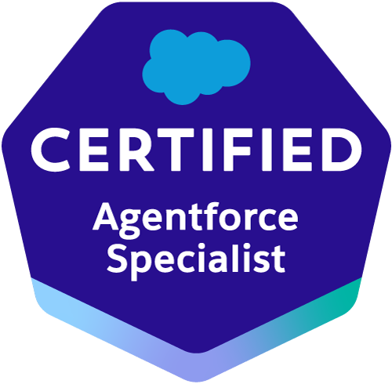
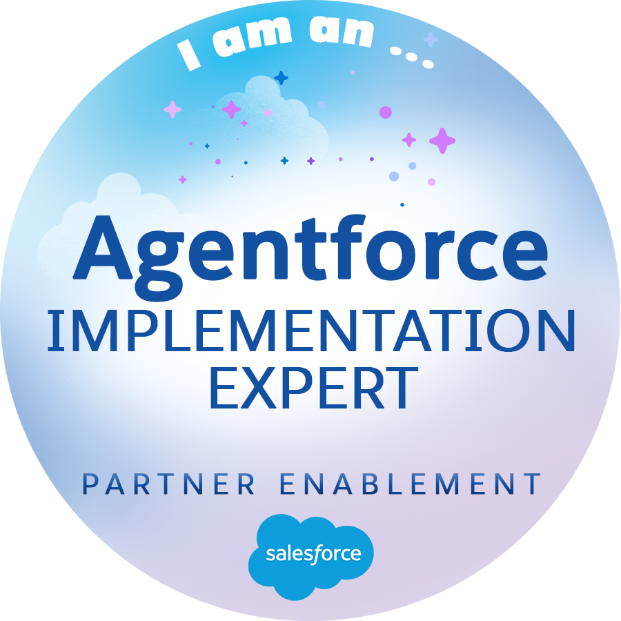

# My Salesforce Journey

## AI-Powered Salesforce Agents

  <a href="./AI%20Service%20Agent/readme.md">
    
    AI Agent for Service
  </a>

  <a href="./AI%20Sales%20Agent/readme.md">
    
    AI Agent for Sales
  </a>

  <a href="./AI%20Slack%20Agent/readme.md">
    
    AI Agent for Slack
  </a>

## Machine Learning Tools in Salesforce

  <a href="./AI%20Agentforce%20Grid/readme.md">
    
    Agentforce Grid
  </a>

## Salesforce Flows

  <a href="./Flows/01-ReactiveScreen.md">
    
    Reactive Screens for Flows
  </a>

## AI Certifications

 

